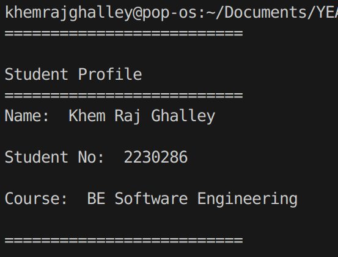
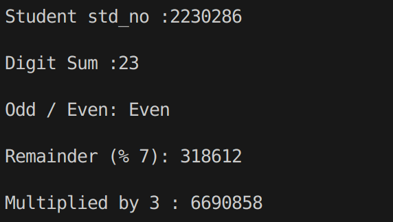
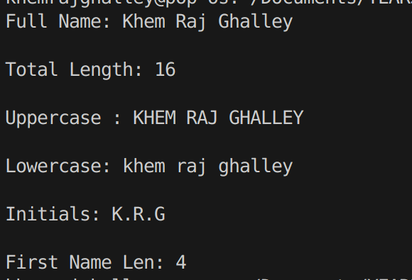
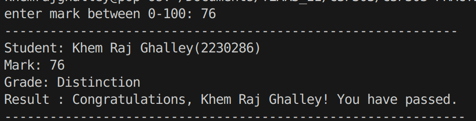
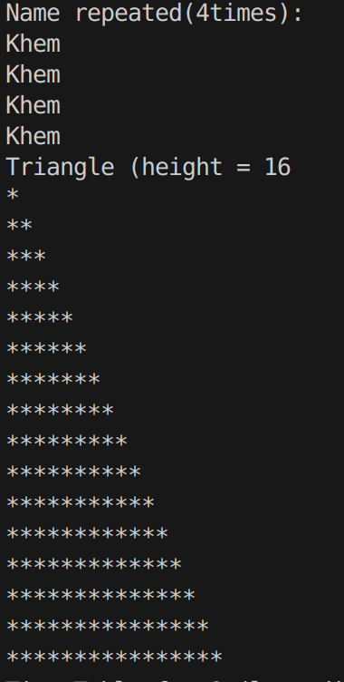
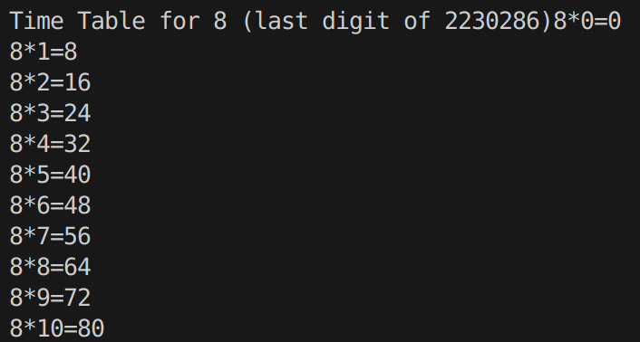
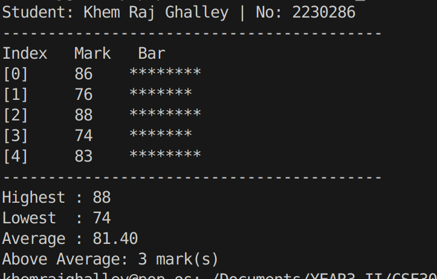
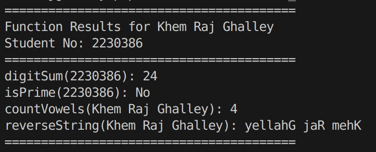
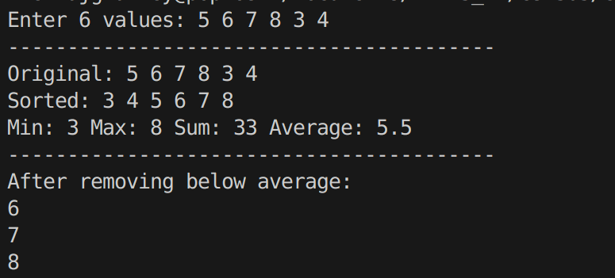

## Practical Report

**Q01 Personal Introduction Output**

Here I learned how to store value using vriable and print it out.

**Arithmetic with Student Number**

This was the first question of C++ where I learn to implement for loop and was able to access each elements and other methods like division and multiplication.

**String Manipulation & Analysis**

This task was much similar to the previous one, where I dealed with numbers and here it's string manipulation. It took a lot of time to complete this task as it requires clear to play with strings.

**Q04 User Input & Type Conversion**

Challenge that reminded me coding in python, nothing new from this question.

**Q05 Conditional Grade Classification**

Conditional (if/else) coding challenges feels easy for me, easy to classify. And the code stays clean. I enjoyed solving it.

**Q06 Loop-Based Pattern Generation**

Displaying the triangle was intresting to solve and the coding for multiplication table as well.

**Q07 Array Operations & Statistics**

Learned to write clean code or small function that makes code easy to read and understand. One of the interesting thing that I learn here is to get length of the array which is completly different from python, in python we use len(), but in C++ it's different thing. I like the rawness of C++.

**Q08 Function Design & Modular Programming**

Some part was just applying repeated concept and the completed thing was to reverse the string.  

**Q9 Vector & Dynamic Collections**

Completely new thing(vector??), but still took it as a data type, which stores some value and I have to access it using for loop, just like in an array. adding element in the vector was new thing that I learned.

**Q10 Classes & Object-Oriented Design**

Last challenge! It reminded me of OOP in python, I regret not learning OOP properly while coding in python. It took lot of time for me to understand the concept of OOP. 

