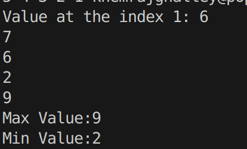
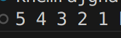
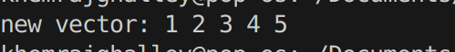
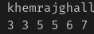
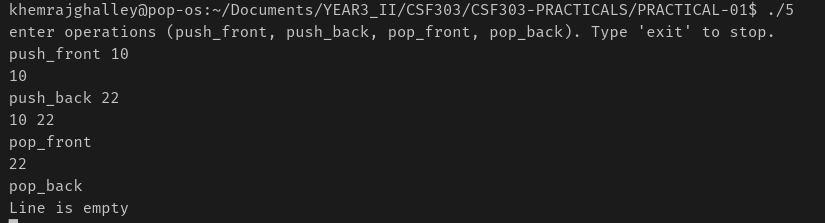
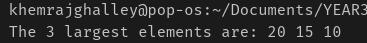
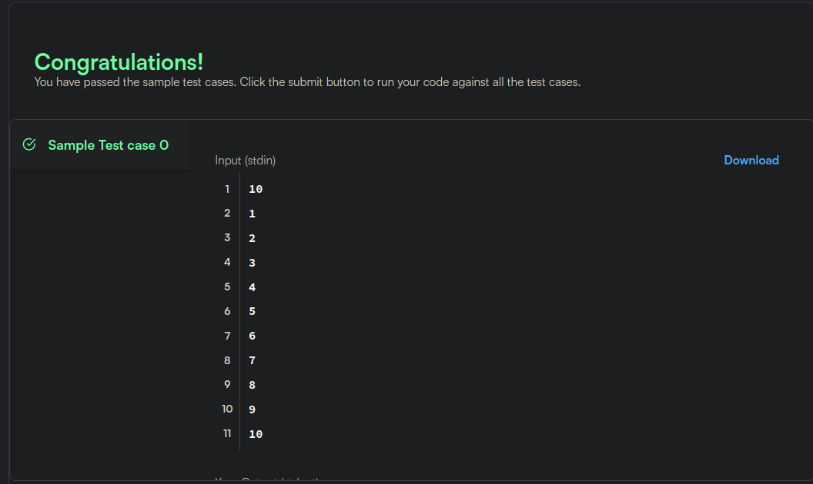
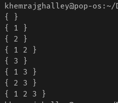
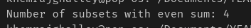
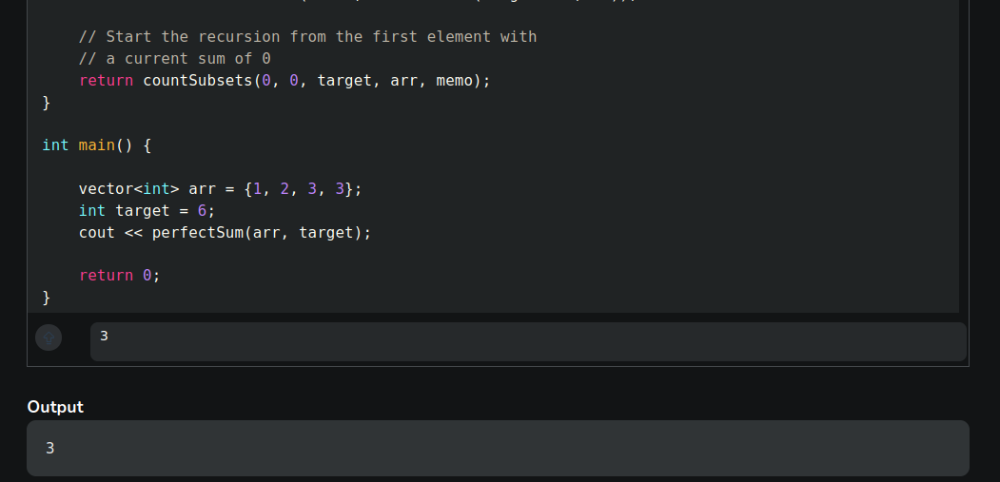

## PRACTICAL-01 REPORT

**Problem 1 — Dynamic Array Basics**

Inserting the element in the vector is similar as appending to array, just the method differs. Finding Min and Max value was not what I have expected, it's quite different from python(easy in python).

**Problem 2 — Reverse the Array**

This problem was easy to solve, just used rbegin to do reverse travesal.

**Remove Duplicates**

It was quite difficult to and I really needed ai to solve this challenge. It is totally different than what I thought.

**Sliding Window Maximum**

Sliding window in the C++ is different from the python, in python we use two pointer and for the C++ we use Dequeue Data Structure which is new to me. Its bit hard to keep track of the code in C++ compared to Python.

**Balanced Line Problem**

This problem teaches all the methods of Dequeue, now I gonna remember these method for little bit longer.

**K Largest Elements**

I learned about Heaps. Now I realized this is how computers handle "tasks with priority" (like your OS deciding which app gets CPU power first).

**Running Median**
I learned to use two priority queues to efficiently track the middle of a data stream without sorting the entire list every time. And also practiced fixing compiler errors by ensuring functions have return statements and proper header declarations.

**Subset Generation**

I learned how to use bits (0s and 1s) to represent decisions (keep or discard) for every item in a list.

**Count Subsets with Even Sum**

I learned how to combine bitmasking with the modulo operator to filter and count specific subsets based on their mathematical properties. And also practiced using a running counter to track results across all possible combinations.

**Count of subsets with sum equal to target**

The problem asks to count all subsets that equal a target sum. The JavaScript code uses memoization to avoid repeating calculations, which makes the solution significantly faster than a basic brute-force approach.
