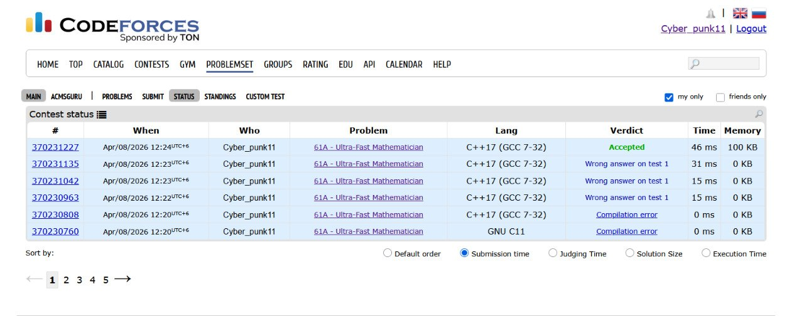
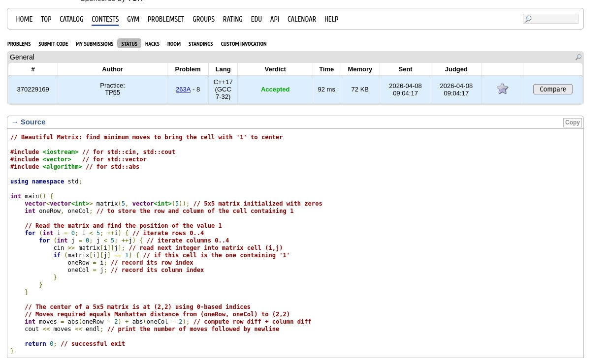
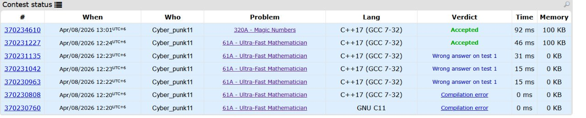

# CSF Practical 5

| No. | Problem | Level |
| --- | ------- | ----- |
| 1 | Ultra-Fast Mathematician | 1 |
| 2 | A boy or girl | 1 |
| 3 | Nearly Lucky number | 1 |
| 4 | Beautiful Matirx | 1 |
| 5 | Magic Numbers | 2 |
| 6 |   Beautiful Year         |1|

---
## 1. Ultra-Fast Mathematician 
### 1. Problem Statement

The problem requires us to simulate the mental calculations of a fast mathematician named Shapur. We are given two numbers of equal length, consisting entirely of the digits 0 and 1. These numbers can be up to 100 digits long and may contain leading zeros.

The task is to generate a third number of the same length based on a specific position-by-position comparison rule:
- If the digits at the same position in both numbers are different, the resulting digit is 1.

- If the digits at the same position are the same, the resulting digit is 0.

- The final output must retain all leading zeros.

### 2. Logic Used

The core logic of this problem is based on the XOR (Exclusive OR) bitwise operation. The XOR logic dictates that the output is true (1) only when the inputs differ.

Instead of doing mathematical addition or subtraction, we treat the operation as a simple difference check:

- 0 and 0 ➔ 0 (Same)
- 1 and 1 ➔ 0 (Same)
- 1 and 0 ➔ 1 (Different)
- 0 and 1 ➔ 1 (Different)

### 3. Approach Taken

Because the numbers can be up to 100 digits long and can have leading zeros, storing them as standard integer data types (like int or long long in C++) will not work. Standard integers would drop the leading zeros and overflow because of the length.

The String Approach:
- Read Inputs as Strings: We take the two numbers as std::string variables. This preserves leading zeros and handles lengths well beyond 100 characters.

- Iterate and Compare: We use a for loop to iterate from index 0 to the end of the string.

- Construct the Result: Inside the loop, we compare the character of the first string at index i with the character of the second string at index i.

- Append: If they are not equal (!=), we append a '1' to our result string. Otherwise, we append a '0'.

### Complexity Analysis
#### Time Complexity: O(N)
Reasoning: N represents the length of the input strings. The program uses a single for loop that runs exactly N times, performing a constant-time O(1) comparison at each step. This makes it highly efficient and well within the 2-second time limit.

#### Space Complexity: O(N)
Reasoning: We allocate memory for the two input strings and one result string, all of which scale linearly with the length N of the input. Since the maximum length is only 100 characters, the memory used is microscopic and easily satisfies the 256 megabytes limit. (Note: Space complexity could be reduced to O(1) auxiliary space if we printed the characters directly to the console instead of storing them in a result string).

#### Screenshot

---

## 2. A boy or girl

### 1. Problem Statement
Given a username made of lowercase letters, count how many different letters appear. If this count is even, print "CHAT WITH HER!"; if odd, print "IGNORE HIM!".

### 2. Logic Used
Only unique letters matter, not how many times each letter repeats. So we track whether each alphabet letter has appeared and count the total unique letters.

### 3. Approach Taken
1. Read the username as a string.
2. Use a boolean array of size 26 to mark seen letters.
3. Count marked positions to get distinct letters.
4. If the count is even, print "CHAT WITH HER!"; otherwise print "IGNORE HIM!".

### 4. Complexity Analysis
Time Complexity: O(n), where n is the length of the username.

Space Complexity: O(1), because the extra storage is a fixed-size array of 26 elements.

#### Screenshot 

--- 

## 3. Nearly Lucky number
### 1. Problem Statement

Determine if the total count of lucky digits(4 or 7) in a given number is itself a lucky number(count must be 4 or 7).

### 2. Given
Lucky digits: 4 & 7
Nearly lucky must contain lucky digit & the length of the number must be lucky digits(4 or 7).

### 3. Approach
1. Let user insert the number and it should be stored as string so it will be easy to get the length of number and iterate.
2. we need to check if the input contains only digits. If not, return "NO".
3. Check if the length of the number is 4 or 7. If not, return "NO".
4. Use a for loop to iterate through each digit in the string.
5. Count how many times the digits 4 or 7 appear in the number.
6. If the count equals 4 or 7, then the number is nearly lucky, so print "YES".
7. Else, print "NO".

### 4. Complexity Analysis
**Time Complexity**

This approach uses for loop so Time Complexity will be O(n).

**Space compexity**

Use space for storing user input that will be O(n)

### Screenshot

---

## 4. Beautiful Matrix

### 1. Problem Statement 
Given a 5×5 matrix containing exactly one 1 and the rest 0s, determine the minimum number of moves required to bring the 1 to the center cell (row 3, column 3). A move swaps the 1 with an adjacent cell (up, down, left or right).

### 2. Algorithm / Approach
- Read the 5×5 grid and locate the coordinates (r, c) of the element 1 (1-based indexing).
- The answer is the distance to the center: abs(r - 3) + abs(c - 3).

This approach is direct and optimal for this problem.

### 3. Time & Space complexity
- Time: O(1) — the algorithm scans a fixed 25 elements.
- Space: O(1) — constant extra memory.

#### screenshot

---

##  5. Beautiful Year
### 1. Problem statement
Given a year y (typically a four-digit integer), find the smallest year strictly greater than y such that all digits of the year are distinct.

### 2. Approach
- Start with year = y + 1 and iterate upward.
- For each candidate year, check whether its digits are all unique (e.g., convert to string and use a set).
- When a candidate with distinct digits is found, print it and stop.

### 3. Time & Space complexity
- Time: O(k) where k is the number of years checked; for 4-digit years this is bounded and effectively constant in practice.
- Space: O(1) — small fixed memory for digit uniqueness check.

#### screenshot

---

## 6. Magic Numbers
### 1. Problem Statement

The goal of this problem is to determine if a given integer n (up to 109) is a "Magic Number." A number is considered magic if it can be formed entirely by concatenating (joining together) three specific building blocks: 1, 14, and 144.

We are allowed to use these blocks as many times as we want and in any order. If any part of the number cannot be explained by these blocks, it is not a Magic Number.

### 2. Logic Used (The "Rule of Three")

Rather than trying to reconstruct the number using the blocks, it is more efficient to identify what makes a number invalid. A number fails to be "Magic" if it violates any of these three rules:

- The Start Rule: The number must start with the digit 1. This is because all three available blocks (1, 14, 144) start with 1.

- The Ingredient Rule: The number can only contain the digits 1 and 4. If any other digit (like 2, 3, 5...) appears, it is impossible to form.

- The Triple-Four Rule: The number cannot contain three 4s in a row (444).

- One 4 is allowed (it belongs to the block 14).

- Two 4s are allowed (they belong to the block 144).

- Three 4s are impossible because no block starts with a 4 to provide that third digit.

### 3. Approach Taken

To implement this logic, we treat the input as a String. This allows us to look at individual characters and their neighbors easily without using complex mathematical divisions.

Steps:
1. Read input as a string s.
2. Check the first character: If s[0] is not '1', return "NO".
3. Scan the string: Use a loop to check every character.
4. If a character is not '1' and not '4', return "NO".
5. If you find the sequence "444", return "NO".
6. Final Verdict: If the loop finishes without finding any violations, return "YES".

### 4. Complexity Analysis
#### Time Complexity: O(N)
Reasoning: N is the number of digits in the string. We iterate through the string exactly once. Each check inside the loop (digit comparison and the "look-back" at i−1 and i−2) takes constant time.

#### Space Complexity: O(N)
Reasoning: We store the number as a string of length N. For an input of 109, N is only 10, so the memory usage is extremely low (a few bytes).

### screenshot 

--- 

